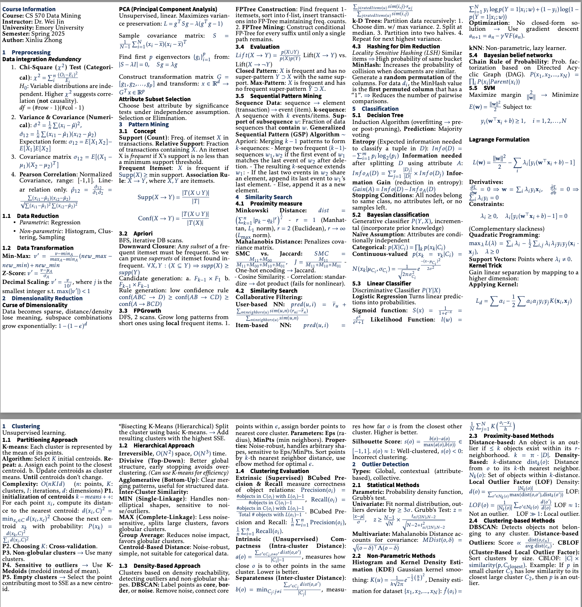

# LaTeX Cheatsheet for CS 570 - Data Mining

## Overview
This repository contains a LaTeX-formatted cheatsheet for **CS 570 - Data Mining** at **Emory University**. The document provides a concise and structured summary of key concepts, algorithms, and mathematical formulations relevant to data mining.

## Course Information
- **Course:** CS 570 - Data Mining  
- **Instructor:** Dr. Wei Jin  
- **University:** Emory University  
- **Semester:** Spring 2025  

📄 **[Download PDF](latex_cheatsheet_master-3.pdf)**  

## 📌 Topics Covered
- **Preprocessing**: Normalization, Feature selection  
- **Dimensionality Reduction**: PCA, Curse of dimensionality  
- **Pattern Mining**: Apriori, FP-Growth, GSP  
- **Classification**: Decision Trees, Naïve Bayes, SVM, Logistic Regression  
- **Clustering**: K-means, DBSCAN, Hierarchical Clustering  
- **Outlier Detection**: Z-score, LOF, CBLOF  
